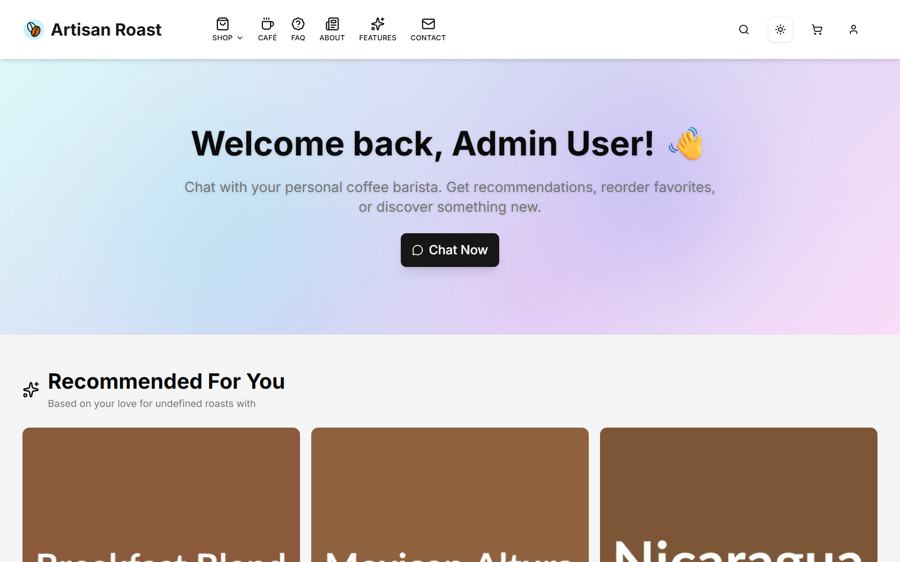
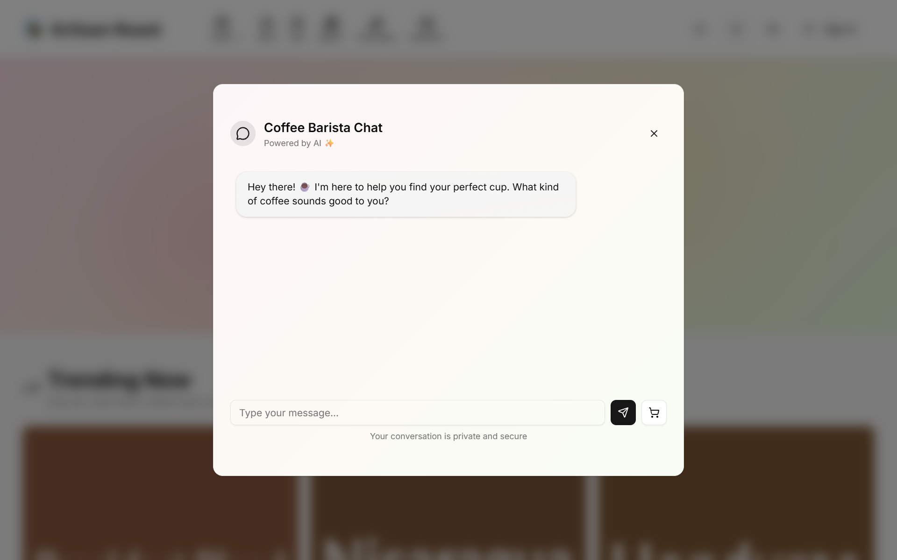
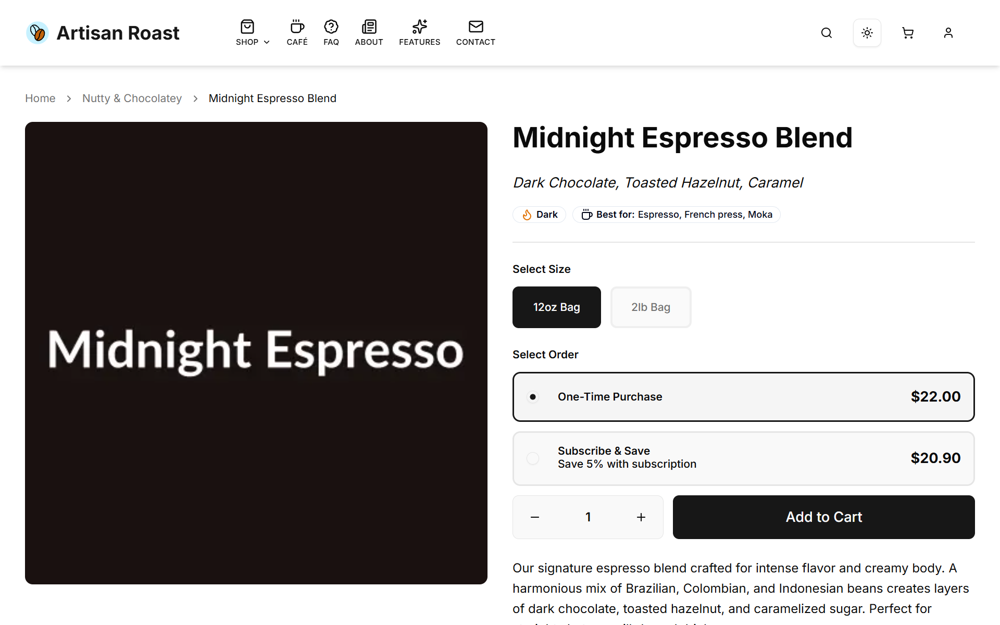
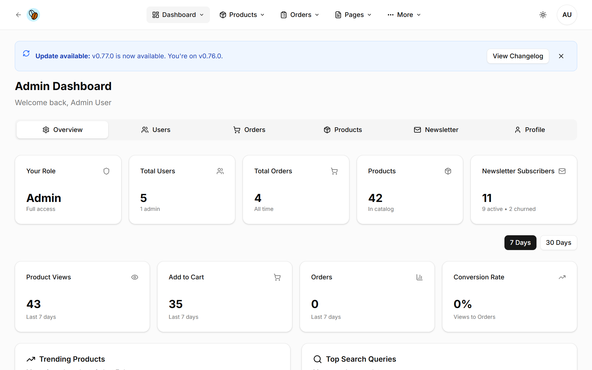
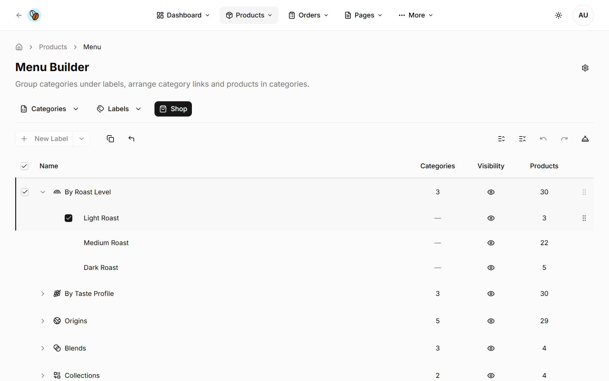

<div align="center">

# Artisan Roast

## The open-source e-commerce platform built for specialty coffee

**Your beans deserve better than Shopify.**

[**Try the Live Demo**](https://artisanroast.app/) | [Self-Host Guide](#quick-start) | [Documentation](./docs/)

[](https://vercel.com/new/clone?repository-url=https%3A%2F%2Fgithub.com%2Fyuens1002%2Fartisan-roast&env=DATABASE_URL,AUTH_SECRET,SEED_ON_BUILD&envDescription=DATABASE_URL%3A%20Neon%20PostgreSQL%20connection%20string.%20AUTH_SECRET%3A%20Run%20%27openssl%20rand%20-base64%2032%27.%20SEED_ON_BUILD%3A%20Set%20to%20%27true%27%20for%20demo%20data.&envLink=https%3A%2F%2Fgithub.com%2Fyuens1002%2Fartisan-roast%2Fblob%2Fmain%2F.env.example&project-name=artisan-roast&repository-name=artisan-roast)

---


</div>

---

## Try the Demo

No signup required. Click **"Sign in as Admin"** or **"Sign in as Demo Customer"** on the [sign-in page](https://artisanroast.app/auth/signin) to explore instantly.

| Account | What You'll See |
|---------|-----------------|
| **Admin** | Full dashboard: products, orders, analytics, Menu Builder, Pages CMS |
| **Demo Customer** | Order history, active subscription, AI-powered recommendations |

> This is a shared demo environment. Please be respectful with the data.

---

## Why Artisan Roast?

Most e-commerce platforms treat coffee like any other product. But your customers don't just want "a bag of coffee" - they want *their* coffee. Light and fruity? Dark and chocolatey? Something new to try?

**Artisan Roast understands coffee.**

- **AI that speaks coffee** - "I like bright, citrusy flavors" → instant recommendations
- **Subscriptions that just work** - Set it and forget it, with easy customer self-service
- **Menu Builder** - Organize your catalog the way *you* think about it (Origins → Ethiopian → Yirgacheffe)
- **Self-host for free** - MIT licensed, your data stays yours

---

## See It In Action

| For Your Customers | For You |
|---|---|
| Browse by origin, roast, or tasting notes | Beautiful admin dashboard |
| AI chat: "What's similar to Ethiopian Yirgacheffe?" | Drag-and-drop menu organization |
| One-click subscriptions | Order management & analytics |
| Stripe checkout (cards, Apple Pay, Google Pay) | Pages CMS with AI content generation |

### Screenshots

<details>
<summary><strong>Homepage</strong> - Clean, modern storefront</summary>



</details>

<details>
<summary><strong>AI Chat Assistant</strong> - Natural language coffee recommendations</summary>



</details>

<details>
<summary><strong>Product Page</strong> - Rich product details with variant selection</summary>



</details>

<details>
<summary><strong>Admin Dashboard</strong> - Analytics and store overview</summary>



</details>

<details>
<summary><strong>Menu Builder</strong> - Drag-and-drop catalog organization</summary>



</details>

---

## Quick Start

### Option 1: One-Click Deploy (Recommended)

[](https://vercel.com/new/clone?repository-url=https%3A%2F%2Fgithub.com%2Fyuens1002%2Fartisan-roast&env=DATABASE_URL,AUTH_SECRET,SEED_ON_BUILD&envDescription=DATABASE_URL%3A%20Neon%20PostgreSQL%20connection%20string.%20AUTH_SECRET%3A%20Run%20%27openssl%20rand%20-base64%2032%27.%20SEED_ON_BUILD%3A%20Set%20to%20%27true%27%20for%20demo%20data.&envLink=https%3A%2F%2Fgithub.com%2Fyuens1002%2Fartisan-roast%2Fblob%2Fmain%2F.env.example&project-name=artisan-roast&repository-name=artisan-roast)

You'll need:

- [Neon](https://neon.tech) account (free tier available) for PostgreSQL database

Optional (add later for full functionality):

- [Stripe](https://stripe.com) account for payment processing
- [Resend](https://resend.com) account (free tier: 3,000 emails/month) for transactional emails

### Option 2: Run Locally

```bash

git clone https://github.com/yuens1002/artisan-roast.git
cd artisan-roast
npm install
cp .env.example .env.local  # Add your API keys
npm run setup               # Database + seed data
npm run dev                 # http://localhost:3000
```

**Full setup guide:** [INSTALLATION.md](./INSTALLATION.md)

---

## Features

### For Customers

- **Smart Search** - Find coffee by name, origin, roast level, or tasting notes
- **AI Recommendations** - Personalized suggestions based on browsing and purchase history
- **AI Chat Assistant** - Ask questions like "What's good for cold brew?"
- **Flexible Subscriptions** - Weekly, bi-weekly, or monthly delivery
- **Subscription Portal** - Pause, skip, or cancel anytime (Stripe Billing Portal)

### For Store Owners

- **Menu Builder** - Visual drag-and-drop catalog organization
  - Multi-select with Shift+click range selection
  - Context menus for bulk operations (clone, delete, move)
  - Keyboard shortcuts (Delete, C, V, H)
  - 5 table views: Menu, Labels, Categories, and detail views
  - Mobile-friendly with 44px touch targets (WCAG 2.5.5)
- **Pages CMS** - AI-powered content management
  - 10-question wizard generates About pages in your brand voice
  - Rich text editing with hero images
  - Draft/publish workflow
- **Admin Dashboard** - Sales, trending products, top searches, activity trends
- **Order Management** - Track orders from purchase to delivery

### Technical

- **Next.js 16** with App Router and React 19
- **Type-safe** end-to-end (TypeScript strict + Prisma)
- **Stripe** payments and subscriptions
- **OAuth** login (Google, GitHub)
- **AI** powered by any OpenAI-compatible provider
- **500+ tests** with Jest and Testing Library

---

## The Stack

| Layer | Technology |
|-------|------------|
| Framework | Next.js 16 (App Router, React 19) |
| Language | TypeScript (strict mode) |
| Database | PostgreSQL (Neon) |
| ORM | Prisma |
| Auth | NextAuth.js v5 |
| Payments | Stripe Checkout + Billing Portal |
| Email | Resend |
| AI | Any OpenAI-compatible provider |
| Styling | Tailwind CSS 4 + shadcn/ui |
| State | Zustand (cart) + SWR (data) |
| Testing | Jest + Testing Library |
| Deployment | Vercel |

---

## Roadmap

- [x] Core e-commerce (cart, checkout, orders)
- [x] Stripe subscriptions
- [x] AI product recommendations
- [x] AI chat assistant
- [x] Menu Builder (drag-and-drop catalog)
- [x] Pages CMS with AI generation
- [ ] Voice AI barista (demo only)
- [ ] Inventory management
- [ ] Multi-store support

---

## Contributing

We welcome contributions! See [CONTRIBUTING.md](./CONTRIBUTING.md) for guidelines.

**Quick wins we'd love help with:**

- Documentation improvements
- Accessibility audits
- Translation/i18n
- Bug reports and fixes

---

## License

MIT License - Use it however you want. See [LICENSE](./LICENSE).

---

<div align="center">

**Built by a coffee nerd who codes.**

[Demo](https://artisanroast.app/) · [GitHub](https://github.com/yuens1002/artisan-roast) · [Setup Guide](./INSTALLATION.md)

</div>
