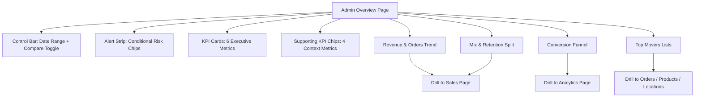

# Admin Overview — Visual Mockup (Desktop + Mobile)

> **Status:** Draft visual spec
> **Date:** 2026-03-03
> **Page:** `/admin`

---

## Desktop Wireframe (Primary)

```text
┌────────────────────────────────────────────────────────────────────────────────────────────────────┐
│ Admin Dashboard                                                [Date Range ▼] [Compare: Prev ✓]    │
│ Welcome back, <admin>                                                                 [Refresh]    │
├────────────────────────────────────────────────────────────────────────────────────────────────────┤
│ ALERT STRIP (conditional)                                                                          │
│ [Refund spike +2.4%] [Failed orders high] [Churn rising]                                           │
├────────────────────────────────────────────────────────────────────────────────────────────────────┤
│ KPI CARDS (6)                                                                                      │
│ [Revenue] [Orders] [AOV] [Net Revenue] [View→Order Conv] [Repeat Customer Rate]                   │
│ [value + delta] on each card                                                                        │
├────────────────────────────────────────────────────────────────────────────────────────────────────┤
│ SUPPORTING KPI CHIPS                                                                               │
│ [Subscription %] [Refund %] [Fulfillment %] [Active Subscriber %]                                  │
├───────────────────────────────────────────────┬────────────────────────────────────────────────────┤
│ Revenue & Orders Trend                        │ Conversion Funnel                                  │
│ (area/line toggle)                            │ Views → Add to Cart → Orders                      │
│ + prior period overlay                        │ + step conversion percentages                      │
├───────────────────────────────────────────────┴────────────────────────────────────────────────────┤
│ Mix & Retention                                                                               [↗]  │
│ Subscription vs One-time split   |   New vs Repeat split                                           │
├────────────────────────────────────────────────────────────────────────────────────────────────────┤
│ Top Movers & Insights                                                                             │
│ Left: Top Products by Revenue     Middle: Top Locations     Right: Top Searched Terms             │
│ (each row clickable to drill-through)                                                              │
└────────────────────────────────────────────────────────────────────────────────────────────────────┘
```

---

## Mobile Wireframe (Stacked)

```text
┌──────────────────────────────────────┐
│ Admin Dashboard                      │
│ [Date ▼] [Compare ✓]                 │
├──────────────────────────────────────┤
│ Alerts (scrollable chips)            │
├──────────────────────────────────────┤
│ KPI carousel / 2-col compact grid    │
│ Revenue | Orders                      │
│ AOV     | Net Revenue                 │
│ Conv    | Repeat Rate                 │
├──────────────────────────────────────┤
│ Supporting KPI chips (wrap)          │
├──────────────────────────────────────┤
│ Revenue Trend chart                  │
├──────────────────────────────────────┤
│ Funnel chart                         │
├──────────────────────────────────────┤
│ Mix chart                            │
├──────────────────────────────────────┤
│ Top Movers list tabs                 │
│ [Products] [Locations] [Searches]    │
└──────────────────────────────────────┘
```

---

## Section Mapping

| Section | Purpose | Primary Metrics |
|---|---|---|
| Alert Strip | Immediate operator attention | Refund spike, failed/cancelled rate, churn spike |
| KPI Cards | Executive health in <30s | Revenue, Orders, AOV, Net, Conversion, Repeat rate |
| KPI Chips | Supporting context | Subscription %, Refund %, Fulfillment %, Active subscribers % |
| Trend Chart | Momentum + seasonality | Revenue and Orders over time |
| Funnel | Conversion diagnostics | Views, Add-to-cart, Orders, step rates |
| Mix & Retention | Revenue quality | Subscription vs one-time, new vs repeat |
| Top Movers | Where to act next | Product, location, search insights |

---

## Interaction Notes

- One global date range drives all widgets.
- Every KPI card and chart segment is clickable and deep-links to filtered detail pages.
- Deltas use consistent color semantics and always compare against prior matching period.
- Empty states are explicit (`No orders in selected period`) instead of blank charts.

---

## Mermaid Layout Diagram



---

## Suggested Component Blocks (Implementation-Friendly)

- `OverviewControlBar`
- `OverviewAlertStrip`
- `OverviewKpiGrid`
- `OverviewKpiChips`
- `RevenueOrdersTrendCard`
- `ConversionFunnelCard`
- `MixRetentionCard`
- `TopMoversCard`

This keeps the page modular while matching the existing admin shell.
