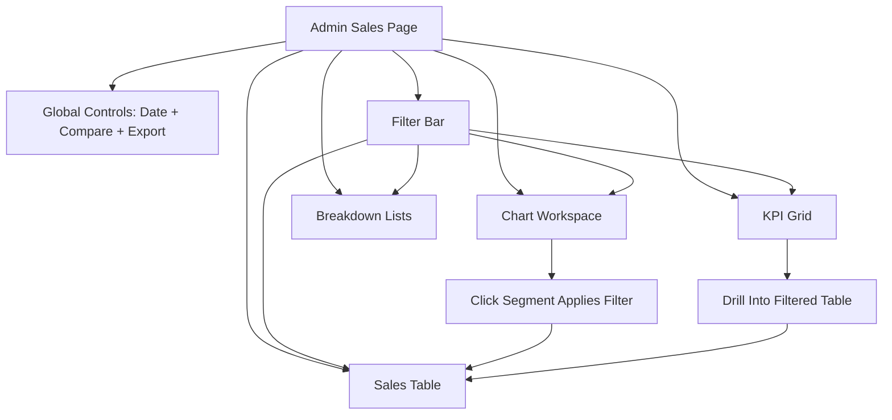

# Admin Sales Page — Visual Mockup (Desktop + Mobile)

> **Status:** Draft visual spec
> **Date:** 2026-03-04
> **Page:** `/admin/sales`

---

## Desktop Wireframe (Primary)

```text
┌────────────────────────────────────────────────────────────────────────────────────────────────────┐
│ Sales Analytics                                              [Date Range ▼] [Compare: Prev ✓]      │
│ Deep-dive reporting for revenue, orders, and customer mix                           [Export CSV]   │
├────────────────────────────────────────────────────────────────────────────────────────────────────┤
│ FILTER BAR                                                                                          │
│ [Order Type ▼] [Status ▼] [Product ▼] [Category ▼] [Promo ▼] [Location ▼] [Reset]                │
├────────────────────────────────────────────────────────────────────────────────────────────────────┤
│ KPI GRID (8–12 cards)                                                                               │
│ [Total Revenue] [Net Revenue] [AOV] [Refund Rate] [Orders] [Fulfillment] [Sub Rev %] [Promo %]   │
│ each card: value + period delta + drill link                                                       │
├───────────────────────────────────────────────┬────────────────────────────────────────────────────┤
│ Chart Workspace                               │ Breakdown Panel                                    │
│ [Revenue Trend | Category | Sub Split |      │ [Top Categories]                                   │
│  Location | Order Status]                     │ [Top Products]                                     │
│                                               │ [Top Locations]                                    │
├───────────────────────────────────────────────┴────────────────────────────────────────────────────┤
│ SALES TABLE                                                                                         │
│ Columns: Order # | Date | Customer | Items | Type | Promo | Subtotal | Discount | Tax | Shipping  │
│          Total | Refunded | Status | City/State                                                     │
│ Row click: open order detail | Sortable headers | Pagination | Table footer totals                 │
└────────────────────────────────────────────────────────────────────────────────────────────────────┘
```

---

## Mobile Wireframe (Stacked)

```text
┌──────────────────────────────────────┐
│ Sales Analytics                      │
│ [Date ▼] [Compare ✓] [CSV]           │
├──────────────────────────────────────┤
│ Filter chips (horizontal scroll)     │
│ [Type] [Status] [Product] [More]     │
├──────────────────────────────────────┤
│ KPI cards (2-col compact grid)       │
│ Revenue | Orders                     │
│ AOV     | Refund %                   │
│ Sub %   | Fulfillment %              │
├──────────────────────────────────────┤
│ Chart selector tabs                  │
│ [Trend] [Split] [Category] [Status]  │
├──────────────────────────────────────┤
│ Active chart                         │
├──────────────────────────────────────┤
│ Sales records list/table             │
│ sticky mini header + pagination      │
└──────────────────────────────────────┘
```

---

## Section Mapping

| Section | Purpose | Metrics/Outputs |
|---|---|---|
| Header + Date Controls | Global period context | Date range, comparison toggle, CSV export |
| Filter Bar | Narrow analysis scope | Type, status, product, category, promo, location |
| KPI Grid | At-a-glance key numbers | Revenue, orders, AOV, refund, fulfillment, mix |
| Chart Workspace | Trend and composition analysis | Trend, category, split, location, status |
| Breakdown Panel | Fast prioritization | Top categories/products/locations |
| Sales Table | Audit-grade detail view | Order-level records and totals |

---

## Interaction Notes

- One filter state drives cards, charts, table, and export.
- Chart clicks apply cross-filters to the table (e.g., category segment -> filtered rows).
- Table footer includes visible-scope totals so numbers reconcile with KPI context.
- Export output must exactly match active filters and date window.

---

## States to Design

### Loading

- skeleton cards for KPI grid
- chart placeholder with loader
- table row skeletons

### Empty

- no data callout: `No sales data for selected filters`
- quick actions: `Reset filters`, `Last 30 days`

### Error

- non-blocking section-level errors where possible
- retry action for chart/table fetch

---

## Mermaid Layout Diagram



---

## Suggested Component Blocks

- `SalesPageControlBar`
- `SalesFilterBar`
- `SalesKpiGrid`
- `SalesChartWorkspace`
- `SalesBreakdownPanel`
- `SalesReportTable`

These blocks map cleanly to the reporting flow used in common e-commerce admin analytics dashboards.
