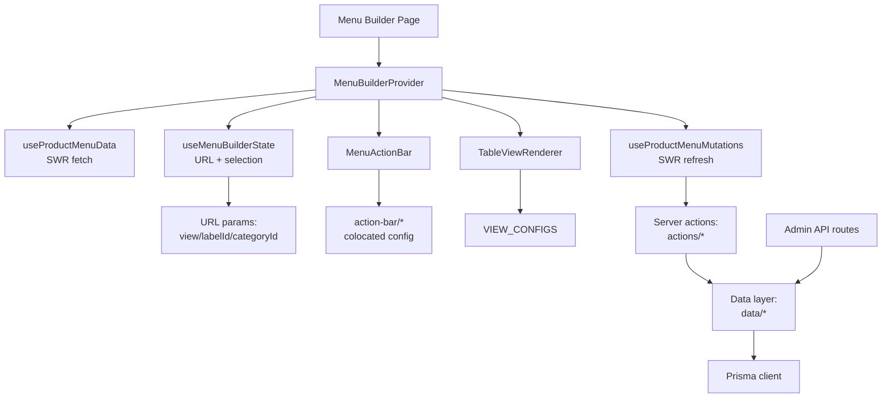

# Menu Builder Architecture

**Last Updated:** 2026-01-26
**Status:** Phase 1 Complete ✅, Phase 2 Complete ✅, Phase 3 Complete ✅

---

## Overview

The Menu Builder is an admin interface for managing a 3-level product catalog hierarchy:

```text
Labels → Categories → Products
```

It uses a **config-driven, provider-composed** architecture with URL-backed navigation and real-time persistence.

---

## System Diagram



---

## Core Principles

1. **Config-driven UI** - Action bars and table views are driven by configuration, not conditionals
2. **URL-backed navigation** - View state persists in URL params for deep linking
3. **Provider composition** - Single context provides data, mutations, and UI state
4. **Colocated config** - Related config lives together (actions with their effects)
5. **No deletion** - Items are hidden/detached, never deleted from this UI

---

## Source of Truth Table

| Concern | Source of Truth | Location |
|---------|-----------------|----------|
| View navigation | URL params + `useMenuBuilderState` | `hooks/useMenuBuilderState.ts` |
| Action bar UI/behavior | `ACTION_BAR_CONFIG` | `constants/action-bar/*` |
| View surface metadata | `VIEW_CONFIGS` | `constants/view-configs.ts` |
| Table component mapping | `TableViewRenderer` | `components/table-views/TableViewRenderer.tsx` |
| DB operations | Data layer | `data/categories.ts`, `data/labels.ts` |

---

## View Matrix

| View | Table Component | Primary Rows | Status |
|------|-----------------|--------------|--------|
| `menu` | MenuTableView | Labels → Categories (2-level hierarchy) | **Shipped** |
| `label` | LabelTableView | Categories in label | **Shipped** |
| `category` | CategoryTableView | Products in category | **Shipped** |
| `all-labels` | AllLabelsTableView | Flat list of labels | **Shipped** |
| `all-categories` | AllCategoriesTableView | Flat list of categories | **Shipped** |

---

## Action Bar Architecture

The action bar uses a **colocated config pattern** (refactored v0.61.0):

```text
constants/action-bar/
├── model.ts      # Types only (ActionBase, ActionSlot, ViewConfig, etc.)
├── shared.ts     # Helpers (hasSelection, modKey, etc.)
├── actions.ts    # All action definitions with execute/effects colocated
├── views.ts      # Per-view layout with explicit left/right arrays
└── index.ts      # Hydration (getActionsForView) + exports
```

### How It Works

1. **actions.ts** - Each action is fully defined in one place:

   ```typescript
   clone: {
     id: "clone",
     icon: Copy,
     label: "Clone",
     tooltip: "Duplicate selected items",
     kbd: [modKey, "D"],
     disabled: (state) => !hasSelection(state),
     onClick: async (_state, actions) => { await actions.cloneSelected(); },
     execute: {
       "all-categories": async ({ selectedIds, mutations }) => { /* ... */ },
     },
     effects: {
       refresh: { "all-categories": ["categories"] },
       successToast: { "all-categories": { title: "Cloned categories" } },
     },
   }

```

2. **views.ts** - Explicit left/right layout per view:
   ```typescript
   menu: {
     left: [
       { id: "new-label", type: "combo", comboWith: "add-labels" },
       { id: "add-labels", type: "combo", comboWith: "new-label" },
       { id: "clone" },
       { id: "remove", tooltip: "Hide from menu" },  // inline override
     ],
     right: [
       { id: "visibility" },
       { id: "expand-all" },
       { id: "collapse-all" },
       { id: "undo" },
       { id: "redo" },
     ],
   }
```

1. **index.ts** - Hydrates slots with base definitions:

   ```typescript
   const actions = getActionsForView("menu");
   // Returns ActionDefinition[] with position, type, and all metadata

```

### Benefits

- **Single location** per action - no hunting across files
- **Explicit layout** - left/right arrays show exact order
- **Inline overrides** - view-specific tooltips visible where used
- **Structural tests** - snapshot catches ordering/positioning regressions

---

## DnD Architecture (v0.66.20)

Drag-and-drop uses a **layered hook architecture**:

```prisma
┌─────────────────────────────────────────────────────────┐
│                    Table Views                          │
│  AllLabelsTableView, CategoryTableView, LabelTableView  │
│                    MenuTableView                        │
└─────────────────────────┬───────────────────────────────┘
                          │
          ┌───────────────┴───────────────┐
          ▼                               ▼
┌─────────────────────┐       ┌─────────────────────────┐
│  useSingleEntityDnd │       │   useMultiEntityDnd     │
│   (flat tables)     │       │   (hierarchical)        │
└─────────┬───────────┘       └───────────┬─────────────┘
          │                               │
          └───────────┬───────────────────┘
                      ▼
          ┌─────────────────────┐
          │  useGroupedReorder  │  ← Core shared state
          │  (drag state, drop) │
          └─────────────────────┘
                      │
          ┌───────────┴───────────┐
          ▼                       ▼
┌─────────────────┐     ┌─────────────────────┐
│ useDnDEligibility│     │ useGroupedEntitiesGhost│
│ (from selection) │     │ (multi-drag visual)    │
└─────────────────┘     └─────────────────────┘
```

### Key Hooks

| Hook | Purpose |
|------|---------|
| `useGroupedReorder` | Core state: dragId, draggedIds, dragOverId, dropPosition |
| `useSingleEntityDnd` | Flat list reorder (wraps useGroupedReorder) |
| `useMultiEntityDnd` | Hierarchical DnD with cross-boundary moves |
| `useDnDEligibility` | Derives drag eligibility from selection state |

### Identity System

Row identity is managed via `IdentityRegistry` (see `types/identity-registry.ts`):

```json

type EntityIdentity = {
  key: string;        // Unique key: "label:id" or "category:parentId~id"
  kind: string;       // Entity type: "label", "category", "product"
  depth: number;      // Hierarchy position: 0, 1, 2...
  entityId: string;   // The entity's ID
  parentKey: string | null;
  childKeys: string[];
};
```

**Note:** Current `FlatMenuRow` uses `level` to mean entity type (should be `kind`).
See [refactor-level-vs-kind.md](./refactor-level-vs-kind.md) for planned refactor.

---

## Context Menu Architecture (v0.70.3)

Right-click context menus provide quick actions per view+entity combination.

### Config-Driven Actions

Actions are determined by `CONTEXT_MENU_CONFIG` mapping `ViewType:EntityKind` to available actions:

```typescript

const CONTEXT_MENU_CONFIG: Record<ViewEntityKey, ContextMenuActionId[]> = {
  "menu:label": ["clone", "remove", "move-up", "move-down", "delete"],
  "all-labels:label": ["manage-categories", "clone", "visibility", "move-up", "move-down", "delete"],
  "menu:category": ["clone", "visibility", "move-up", "move-down", "move-to"],
  "label:category": ["clone", "remove", "move-up", "move-down", "move-to"],
  "all-categories:category": ["manage-labels", "clone", "visibility", "delete"],
  "category:product": ["manage-categories", "remove", "move-up", "move-down"],
};
```

### Shared Handler Hooks

Handler logic is extracted to reusable hooks in `hooks/context-menu/`:

| Hook | Purpose |
|------|---------|
| `useContextRowHighlight` | Row highlighting when context menu opens |
| `useMoveHandlers` | Move up/down (supports flat and nested lists) |
| `useBulkAction` | Bulk operation executor with `getTargetIds` |
| `useDeleteConfirmation` | Delete dialog state management |
| `useContextClone` | Clone with bulk support |
| `useContextVisibility` | Visibility toggle with bulk support |
| `useContextRemove` | Remove from parent with bulk support |
| `useContextMoveTo` | Move to another parent |
| `useRelationshipToggle` | Attach/detach relationship management |

### Key Patterns

1. **Config as source of truth** - `CONTEXT_MENU_CONFIG` defines what appears; consumers must match
2. **Bulk vs single operations** - `getTargetIds(entityId)` returns single ID or all selected
3. **Position flags** - `getPositionFlags(id)` returns `{isFirst, isLast}` for move action disabling
4. **Unified move handlers** - Single `useMoveHandlers` supports both `items` (flat) and `getItems(parentId)` (nested)

---

## Data Layer

Centralized Prisma operations with DTO mapping:

```text
data/
├── categories.ts   # Category CRUD + DTO mapping
├── labels.ts       # Label CRUD + DTO mapping
└── __tests__/      # DTO invariant tests
```

### Key Patterns

- **DTO mapping** - Prisma types → UI types with guaranteed ordering
- **Ordering invariants** - Tests ensure sort order is consistent
- **Shared helpers** - Admin API routes use same data layer

---

## Provider Composition

`MenuBuilderProvider` composes three hooks into a single context:

```typescript

// MenuBuilderProvider.tsx
const data = useProductMenuData();        // SWR fetch: labels, categories, products
const mutations = useProductMenuMutations(); // CRUD wrappers that revalidate SWR
const builder = useMenuBuilderState();    // URL nav + selection + expand/collapse

const value = { ...data, ...mutations, builder };
```

Consumer usage:

```typescript

const { builder, labels, categories, products, updateCategory } = useMenuBuilder();
```

---

## URL State

Navigation state persists in URL params:

```text
/admin/menu-builder?view=menu
/admin/menu-builder?view=label&labelId=abc123
/admin/menu-builder?view=category&categoryId=def456
/admin/menu-builder?view=all-labels
/admin/menu-builder?view=all-categories
```

Selection and expand/collapse are local UI state (not URL-backed).

---

## File Structure

```tsx
app/admin/(product-menu)/
├── menu-builder/
│   ├── MenuBuilder.tsx              # Main component
│   ├── MenuBuilderProvider.tsx      # Context provider
│   └── components/
│       ├── menu-action-bar/         # Action bar components
│       │   ├── index.tsx            # Main action bar
│       │   ├── ActionButton.tsx
│       │   ├── ActionComboButton.tsx
│       │   └── ActionDropdownButton.tsx
│       └── table-views/
│           ├── TableViewRenderer.tsx
│           ├── AllCategoriesTableView.tsx  # Column sorting example
│           ├── AllLabelsTableView.tsx      # Flat DnD example
│           ├── CategoryTableView.tsx       # Sortable + DnD
│           ├── LabelTableView.tsx          # Sortable + DnD
│           ├── MenuTableView.tsx           # Hierarchical 2-level
│           ├── MenuTableView.types.ts      # FlatMenuRow types
│           └── shared/
│               ├── cells/           # CheckboxCell, InlineNameEditor, InlineIconCell, VisibilityCell, etc.
│               └── table/           # TableRow, TableCell, TableHeader, GroupedEntitiesGhost
├── hooks/
│   ├── useMenuBuilderState.ts       # URL + selection state
│   ├── useProductMenuData.ts        # SWR data fetching
│   ├── useProductMenuMutations.ts   # CRUD wrappers
│   ├── useContextSelectionModel.ts  # Hierarchical selection with tri-state
│   ├── useContextRowUiState.ts      # Editing/pinned row state
│   ├── usePinnedRow.ts              # Pinned row + default sorting
│   ├── useInlineEditHandlers.ts     # Name/icon/visibility handlers with undo
│   ├── useIdentityRegistry.ts       # Row identity management
│   ├── useRowClickHandler.ts        # Unified click handling
│   ├── context-menu/                # Context menu hooks (v0.70.3)
│   │   ├── useContextRowHighlight.ts
│   │   ├── useMoveHandlers.ts
│   │   ├── useBulkAction.ts
│   │   ├── useDeleteConfirmation.ts
│   │   ├── useContextClone.ts
│   │   ├── useContextVisibility.ts
│   │   ├── useContextRemove.ts
│   │   ├── useContextMoveTo.ts
│   │   ├── useRelationshipToggle.ts
│   │   └── index.ts
│   └── dnd/                         # DnD hooks (v0.66.20)
│       ├── useGroupedReorder.ts     # Core shared DnD state
│       ├── useSingleEntityDnd.ts    # Flat table wrapper
│       ├── useMultiEntityDnd.ts     # Hierarchical + cross-boundary
│       ├── useDnDEligibility.ts     # Selection → eligibility
│       └── useGroupedEntitiesGhost.ts
├── constants/
│   ├── action-bar/                  # Colocated action config
│   │   ├── model.ts
│   │   ├── shared.ts
│   │   ├── actions.ts
│   │   ├── views.ts
│   │   └── index.ts
│   └── view-configs.ts              # View surface metadata
├── data/
│   ├── categories.ts                # Category data access
│   ├── labels.ts                    # Label data access
│   └── __tests__/
├── actions/                         # Server actions
│   ├── categories.ts
│   ├── labels.ts
│   └── products.ts
└── types/
    ├── builder-state.ts
    ├── menu.ts
    └── category.ts
```

---

## Testing Strategy

### Unit Tests

- **Config invariants** - All action IDs referenced must exist
- **DTO mapping** - Ordering guarantees preserved
- **Structural snapshots** - Action bar layout locked

### Test Commands

```bash

npm run test:ci                    # All tests
npx jest "action-bar-config"       # Action bar config tests
npx jest "categories.dto"          # DTO tests
```

---

## Adding New Features

### Add a Table View

1. Add `tableViewId` to `TableViewId` union in `view-configs.ts`
2. Create component in `components/table-views/`
3. Register in `TableViewRenderer.tsx`

### Add an Action

1. Add action definition to `actions.ts` with execute/effects
2. Add action ID to appropriate views in `views.ts`
3. If new mutation needed, add to `useProductMenuMutations.ts`
4. Add tests

See [IMPLEMENTATION-GUIDE.md](./IMPLEMENTATION-GUIDE.md) for details.

---

## Decision Log

| Date | Decision | Rationale |
|------|----------|-----------|
| Jan 3, 2026 | Config-driven architecture | 67% complexity reduction, easier testing |
| Jan 8, 2026 | Centralized data layer | Single source of truth, guaranteed ordering |
| Jan 10, 2026 | Ship views incrementally | Lower risk, validates patterns early |
| Jan 13, 2026 | Colocated action-bar config | Better DX, explicit layout, fewer files to touch |
| Jan 14, 2026 | Reusable table view hooks | Extract common patterns (drag, inline edit, click handling) to reduce boilerplate |
| Jan 17, 2026 | 2-level Menu View | Labels → Categories only; products as count (managed in Category view) |
| Jan 21, 2026 | IdentityRegistry pattern | Unified row identity with kind + depth for selection/DnD/navigation |
| Jan 24, 2026 | Consolidated DnD hooks | `useGroupedReorder` as core; `useSingleEntityDnd`/`useMultiEntityDnd` as wrappers |
| Jan 24, 2026 | Level vs Kind separation (planned) | Current `level` conflates entity type with depth; needs refactor for extensibility |
| Jan 26, 2026 | Context menu handler hooks | Extracted ~400 lines of duplicated handler patterns into 9 reusable hooks |

---

## Related Docs

- [ROADMAP.md](./ROADMAP.md) - Progress tracking and next steps
- [IMPLEMENTATION-GUIDE.md](./IMPLEMENTATION-GUIDE.md) - How-to for adding views/actions
- [FEATURE-SPEC.md](./FEATURE-SPEC.md) - Complete target vision
- [context-menu-plan.md](./context-menu-plan.md) - Context menu implementation details
