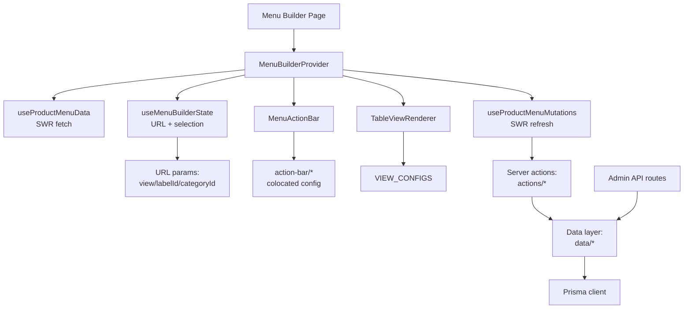

# Menu Builder Architecture

**Last Updated:** 2026-01-13
**Status:** Phase 1 Complete, Phase 2 In Progress

---

## Overview

The Menu Builder is an admin interface for managing a 3-level product catalog hierarchy:

```
Labels → Categories → Products
```

It uses a **config-driven, provider-composed** architecture with URL-backed navigation and real-time persistence.

---

## System Diagram



---

## Core Principles

1. **Config-driven UI** - Action bars and table views are driven by configuration, not conditionals
2. **URL-backed navigation** - View state persists in URL params for deep linking
3. **Provider composition** - Single context provides data, mutations, and UI state
4. **Colocated config** - Related config lives together (actions with their effects)
5. **No deletion** - Items are hidden/detached, never deleted from this UI

---

## Source of Truth Table

| Concern | Source of Truth | Location |
|---------|-----------------|----------|
| View navigation | URL params + `useMenuBuilderState` | `hooks/useMenuBuilderState.ts` |
| Action bar UI/behavior | `ACTION_BAR_CONFIG` | `constants/action-bar/*` |
| View surface metadata | `VIEW_CONFIGS` | `constants/view-configs.ts` |
| Table component mapping | `TableViewRenderer` | `components/table-views/TableViewRenderer.tsx` |
| DB operations | Data layer | `data/categories.ts`, `data/labels.ts` |

---

## View Matrix

| View | Table Component | Primary Rows | Status |
|------|-----------------|--------------|--------|
| `menu` | PlaceholderTableView | Labels (3-level hierarchy) | Planned |
| `label` | PlaceholderTableView | Categories in label | Planned |
| `category` | PlaceholderTableView | Products in category | Planned |
| `all-labels` | PlaceholderTableView | Flat list of labels | Planned |
| `all-categories` | AllCategoriesTableView | Flat list of categories | **Shipped** |

---

## Action Bar Architecture

The action bar uses a **colocated config pattern** (refactored v0.61.0):

```
constants/action-bar/
├── model.ts      # Types only (ActionBase, ActionSlot, ViewConfig, etc.)
├── shared.ts     # Helpers (hasSelection, modKey, etc.)
├── actions.ts    # All action definitions with execute/effects colocated
├── views.ts      # Per-view layout with explicit left/right arrays
└── index.ts      # Hydration (getActionsForView) + exports
```

### How It Works

1. **actions.ts** - Each action is fully defined in one place:
   ```typescript
   clone: {
     id: "clone",
     icon: Copy,
     label: "Clone",
     tooltip: "Duplicate selected items",
     kbd: [modKey, "D"],
     disabled: (state) => !hasSelection(state),
     onClick: async (_state, actions) => { await actions.cloneSelected(); },
     execute: {
       "all-categories": async ({ selectedIds, mutations }) => { /* ... */ },
     },
     effects: {
       refresh: { "all-categories": ["categories"] },
       successToast: { "all-categories": { title: "Cloned categories" } },
     },
   }
   ```

2. **views.ts** - Explicit left/right layout per view:
   ```typescript
   menu: {
     left: [
       { id: "new-label", type: "combo", comboWith: "add-labels" },
       { id: "add-labels", type: "combo", comboWith: "new-label" },
       { id: "clone" },
       { id: "remove", tooltip: "Hide from menu" },  // inline override
     ],
     right: [
       { id: "visibility" },
       { id: "expand-all" },
       { id: "collapse-all" },
       { id: "undo" },
       { id: "redo" },
     ],
   }
   ```

3. **index.ts** - Hydrates slots with base definitions:
   ```typescript
   const actions = getActionsForView("menu");
   // Returns ActionDefinition[] with position, type, and all metadata
   ```

### Benefits

- **Single location** per action - no hunting across files
- **Explicit layout** - left/right arrays show exact order
- **Inline overrides** - view-specific tooltips visible where used
- **Structural tests** - snapshot catches ordering/positioning regressions

---

## Data Layer

Centralized Prisma operations with DTO mapping:

```
data/
├── categories.ts   # Category CRUD + DTO mapping
├── labels.ts       # Label CRUD + DTO mapping
└── __tests__/      # DTO invariant tests
```

### Key Patterns

- **DTO mapping** - Prisma types → UI types with guaranteed ordering
- **Ordering invariants** - Tests ensure sort order is consistent
- **Shared helpers** - Admin API routes use same data layer

---

## Provider Composition

`MenuBuilderProvider` composes three hooks into a single context:

```typescript
// MenuBuilderProvider.tsx
const data = useProductMenuData();        // SWR fetch: labels, categories, products
const mutations = useProductMenuMutations(); // CRUD wrappers that revalidate SWR
const builder = useMenuBuilderState();    // URL nav + selection + expand/collapse

const value = { ...data, ...mutations, builder };
```

Consumer usage:
```typescript
const { builder, labels, categories, products, updateCategory } = useMenuBuilder();
```

---

## URL State

Navigation state persists in URL params:

```
/admin/menu-builder?view=menu
/admin/menu-builder?view=label&labelId=abc123
/admin/menu-builder?view=category&categoryId=def456
/admin/menu-builder?view=all-labels
/admin/menu-builder?view=all-categories
```

Selection and expand/collapse are local UI state (not URL-backed).

---

## File Structure

```
app/admin/(product-menu)/
├── menu-builder/
│   ├── MenuBuilder.tsx              # Main component
│   ├── MenuBuilderProvider.tsx      # Context provider
│   └── components/
│       ├── menu-action-bar/         # Action bar components
│       │   ├── index.tsx            # Main action bar
│       │   ├── ActionButton.tsx
│       │   ├── ActionComboButton.tsx
│       │   └── ActionDropdownButton.tsx
│       └── table-views/
│           ├── TableViewRenderer.tsx
│           ├── PlaceholderTableView.tsx
│           ├── AllCategoriesTableView.tsx  # First shipped view
│           └── shared/
│               ├── cells/           # Reusable cell components
│               └── table/           # Table primitives
├── hooks/
│   ├── useMenuBuilderState.ts       # URL + selection state
│   ├── useProductMenuData.ts        # SWR data fetching
│   └── useProductMenuMutations.ts   # CRUD wrappers
├── constants/
│   ├── action-bar/                  # Colocated action config
│   │   ├── model.ts
│   │   ├── shared.ts
│   │   ├── actions.ts
│   │   ├── views.ts
│   │   └── index.ts
│   └── view-configs.ts              # View surface metadata
├── data/
│   ├── categories.ts                # Category data access
│   ├── labels.ts                    # Label data access
│   └── __tests__/
├── actions/                         # Server actions
│   ├── categories.ts
│   ├── labels.ts
│   └── products.ts
└── types/
    ├── builder-state.ts
    ├── menu.ts
    └── category.ts
```

---

## Testing Strategy

### Unit Tests
- **Config invariants** - All action IDs referenced must exist
- **DTO mapping** - Ordering guarantees preserved
- **Structural snapshots** - Action bar layout locked

### Test Commands
```bash
npm run test:ci                    # All tests
npx jest "action-bar-config"       # Action bar config tests
npx jest "categories.dto"          # DTO tests
```

---

## Adding New Features

### Add a Table View
1. Add `tableViewId` to `TableViewId` union in `view-configs.ts`
2. Create component in `components/table-views/`
3. Register in `TableViewRenderer.tsx`

### Add an Action
1. Add action definition to `actions.ts` with execute/effects
2. Add action ID to appropriate views in `views.ts`
3. If new mutation needed, add to `useProductMenuMutations.ts`
4. Add tests

See [IMPLEMENTATION-GUIDE.md](./IMPLEMENTATION-GUIDE.md) for details.

---

## Decision Log

| Date | Decision | Rationale |
|------|----------|-----------|
| Jan 3, 2026 | Config-driven architecture | 67% complexity reduction, easier testing |
| Jan 8, 2026 | Centralized data layer | Single source of truth, guaranteed ordering |
| Jan 10, 2026 | Ship views incrementally | Lower risk, validates patterns early |
| Jan 13, 2026 | Colocated action-bar config | Better DX, explicit layout, fewer files to touch |

---

## Related Docs

- [ROADMAP.md](./ROADMAP.md) - Progress tracking and next steps
- [IMPLEMENTATION-GUIDE.md](./IMPLEMENTATION-GUIDE.md) - How-to for adding views/actions
- [FEATURE-SPEC.md](./FEATURE-SPEC.md) - Complete target vision
