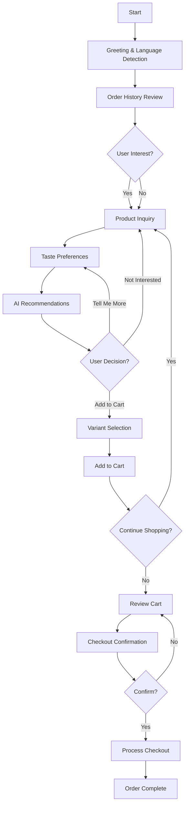

# Voice Barista Conversation Flow

## Overview
Conversational AI checkout assistant for authenticated users. Supports Spanish and English.

---

## Conversation States



---

## Function Definitions

### 1. getUserContext
**Purpose**: Get authenticated user's profile and preferences

**Parameters**: None (uses session)

**Returns**:
```json
{
  "userId": "string",
  "name": "string",
  "email": "string",
  "preferredLanguage": "en" | "es",
  "orderCount": number,
  "totalSpent": number,
  "savedAddresses": [
    {
      "id": "string",
      "street": "string",
      "city": "string",
      "state": "string",
      "postalCode": "string",
      "isDefault": boolean
    }
  ],
  "savedPaymentMethods": [
    {
      "id": "string",
      "last4": "string",
      "brand": "visa" | "mastercard" | "amex",
      "isDefault": boolean
    }
  ]
}
```

---

### 2. getOrderHistory
**Purpose**: Fetch user's recent orders for personalization

**Parameters**: 
```json
{
  "limit": number // default 5
}
```

**Returns**:
```json
{
  "orders": [
    {
      "id": "string",
      "date": "ISO date string",
      "total": number,
      "items": [
        {
          "productName": "string",
          "variantName": "string",
          "quantity": number
        }
      ]
    }
  ],
  "favoriteProducts": ["string"], // Product names
  "preferredRoastLevel": "light" | "medium" | "dark" | null
}
```

---

### 3. searchProducts
**Purpose**: Find products based on natural language query

**Parameters**:
```json
{
  "query": "string", // e.g., "light roast from Ethiopia"
  "filters": {
    "roastLevel": "light" | "medium" | "dark" | null,
    "origin": "string" | null,
    "flavor": "string" | null
  },
  "limit": number // default 5
}
```

**Returns**:
```json
{
  "products": [
    {
      "id": "string",
      "name": "string",
      "slug": "string",
      "description": "string",
      "roastLevel": "string",
      "origin": "string",
      "flavorNotes": ["string"],
      "variants": [
        {
          "id": "string",
          "name": "string", // "12oz", "5lb"
          "priceInCents": number,
          "subscriptionPriceInCents": number | null
        }
      ],
      "inStock": boolean
    }
  ]
}
```

---

### 4. addToCart
**Purpose**: Add product variant to user's cart

**Parameters**:
```json
{
  "productId": "string",
  "variantId": "string",
  "purchaseType": "ONE_TIME" | "SUBSCRIPTION",
  "quantity": number, // default 1
  "billingInterval": "WEEK" | "MONTH" | null, // if subscription
  "billingIntervalCount": number | null // if subscription
}
```

**Returns**:
```json
{
  "success": boolean,
  "cartItemCount": number,
  "cartTotal": number,
  "error": "string" | null, // e.g., "Subscription already exists"
  "message": "string" // User-friendly confirmation
}
```

---

### 5. getCart
**Purpose**: Retrieve current cart contents

**Parameters**: None

**Returns**:
```json
{
  "items": [
    {
      "productName": "string",
      "variantName": "string",
      "quantity": number,
      "priceInCents": number,
      "purchaseType": "ONE_TIME" | "SUBSCRIPTION",
      "imageUrl": "string"
    }
  ],
  "subtotal": number,
  "itemCount": number
}
```

---

### 6. createCheckout
**Purpose**: Initiate Stripe checkout session

**Parameters**:
```json
{
  "deliveryMethod": "DELIVERY" | "PICKUP",
  "selectedAddressId": "string" | null // if delivery
}
```

**Returns**:
```json
{
  "success": boolean,
  "checkoutUrl": "string" | null,
  "error": "string" | null,
  "errorCode": "SUBSCRIPTION_REQUIRES_AUTH" | "SUBSCRIPTION_EXISTS" | "MIXED_BILLING_INTERVALS" | null
}
```

---

## Conversation Templates

### Phase 1: Greeting & Language Detection

**English**:
```
Hi there! Welcome back to Artisan Roast. I'm your personal coffee barista, here to help you find the perfect beans. How can I assist you today?
```

**Spanish**:
```
¡Hola! Bienvenido de nuevo a Artisan Roast. Soy tu barista personal de café, aquí para ayudarte a encontrar los granos perfectos. ¿Cómo puedo ayudarte hoy?
```

**Function Call**: `getUserContext()`

---

### Phase 2: Order History Review

**If user has orders**:
```
English: "I see you've ordered from us before! Last time you got [product name]. Would you like to reorder that, or try something new?"

Spanish: "¡Veo que has pedido con nosotros antes! La última vez compraste [product name]. ¿Te gustaría volver a pedir eso o probar algo nuevo?"
```

**If no orders**:
```
English: "I'm excited to help you discover your first coffee with us! What kind of coffee do you usually enjoy?"

Spanish: "¡Estoy emocionado de ayudarte a descubrir tu primer café con nosotros! ¿Qué tipo de café sueles disfrutar?"
```

**Function Call**: `getOrderHistory(limit: 5)`

---

### Phase 3: Product Inquiry

**Listen for**:
- Specific product names
- Roast levels (light, medium, dark)
- Origins (Ethiopia, Colombia, Guatemala)
- Flavor preferences (chocolatey, fruity, nutty)

**Example Responses**:
```
English: "Great choice! Our Ethiopian Yirgacheffe is a light roast with bright citrus notes. Would you like to hear more about it?"

Spanish: "¡Excelente elección! Nuestro Yirgacheffe de Etiopía es un tueste claro con notas cítricas brillantes. ¿Te gustaría saber más?"
```

**Function Call**: `searchProducts(query, filters)`

---

### Phase 4: Recommendations

**If user wants suggestions**:
```
English: "Based on your love for [past order], I'd recommend our [product name]. It's a [roast level] with [flavor notes]. Perfect for [brew method]. Interested?"

Spanish: "Basado en tu amor por [past order], te recomendaría nuestro [product name]. Es un [roast level] con [flavor notes]. Perfecto para [brew method]. ¿Te interesa?"
```

**Function Call**: `searchProducts()` based on order history

---

### Phase 5: Variant Selection

**Ask about size**:
```
English: "Would you like the 12oz bag for $15, or the 5lb bag for $60?"

Spanish: "¿Te gustaría la bolsa de 12oz por $15, o la bolsa de 5lb por $60?"
```

**Ask about subscription**:
```
English: "Would you like this as a one-time purchase, or subscribe and save 15%? I can set it to deliver weekly, bi-weekly, or monthly."

Spanish: "¿Te gustaría esto como una compra única, o suscribirte y ahorrar 15%? Puedo configurarlo para entregar semanalmente, quincenalmente o mensualmente."
```

---

### Phase 6: Add to Cart

**Confirmation**:
```
English: "Perfect! I've added [product] - [variant] to your cart. Your total is $[amount]. Would you like to add anything else, or are you ready to check out?"

Spanish: "¡Perfecto! He agregado [product] - [variant] a tu carrito. Tu total es $[amount]. ¿Te gustaría agregar algo más, o estás listo para pagar?"
```

**Function Call**: `addToCart(productId, variantId, purchaseType, quantity)`

**If error** (e.g., duplicate subscription):
```
English: "I notice you already have a subscription for this product. Would you like to add it as a one-time purchase instead, or manage your existing subscription?"

Spanish: "Noto que ya tienes una suscripción para este producto. ¿Te gustaría agregarlo como una compra única en su lugar, o administrar tu suscripción existente?"
```

---

### Phase 7: Checkout

**Review cart**:
```
English: "Let me review your order: [list items]. Your total is $[amount]. Shall I proceed to checkout?"

Spanish: "Déjame revisar tu pedido: [list items]. Tu total es $[amount]. ¿Procedo al pago?"
```

**Function Call**: `getCart()`

**Confirm delivery**:
```
English: "Great! I have your address on file at [address]. Should I use that for delivery?"

Spanish: "¡Genial! Tengo tu dirección registrada en [address]. ¿Debo usar esa para la entrega?"
```

**Complete checkout**:
```
English: "Perfect! I'm redirecting you to our secure checkout page. You can complete your purchase there with your saved payment method."

Spanish: "¡Perfecto! Te estoy redirigiendo a nuestra página de pago segura. Puedes completar tu compra allí con tu método de pago guardado."
```

**Function Call**: `createCheckout(deliveryMethod, selectedAddressId)`

---

## Error Handling

### Subscription Exists
```
English: "You already have an active subscription for [product]. Would you like to add it as a one-time purchase instead?"

Spanish: "Ya tienes una suscripción activa para [product]. ¿Te gustaría agregarlo como una compra única en su lugar?"
```

### Out of Stock
```
English: "I'm sorry, [product] is currently out of stock. Would you like me to suggest something similar?"

Spanish: "Lo siento, [product] está actualmente agotado. ¿Te gustaría que te sugiera algo similar?"
```

### Mixed Billing Intervals
```
English: "I notice you have a different subscription frequency in your cart. You'll need to checkout separately for different subscription schedules. Shall I help you with that?"

Spanish: "Noto que tienes una frecuencia de suscripción diferente en tu carrito. Necesitarás pagar por separado para diferentes programas de suscripción. ¿Te ayudo con eso?"
```

### Unclear Input
```
English: "I didn't quite catch that. Could you tell me more about what you're looking for? For example, light or dark roast, or maybe a specific origin?"

Spanish: "No entendí bien eso. ¿Podrías decirme más sobre lo que buscas? Por ejemplo, ¿tueste claro u oscuro, o tal vez un origen específico?"
```

---

## Conversation Guidelines

### Personality
- **Friendly**: Warm, welcoming, enthusiastic about coffee
- **Knowledgeable**: Expert on products, brewing, flavors
- **Concise**: Keep responses under 3 sentences unless asked for details
- **Helpful**: Proactive suggestions based on history
- **Natural**: Use conversational language, not robotic

### Do's
- ✅ Use customer's name
- ✅ Reference order history for personalization
- ✅ Offer comparisons between products
- ✅ Suggest pairings or alternatives
- ✅ Confirm actions (added to cart, checkout initiated)
- ✅ Handle errors gracefully with solutions

### Don'ts
- ❌ Don't pressure to buy
- ❌ Don't overwhelm with too many options (max 3 at a time)
- ❌ Don't repeat the same suggestions
- ❌ Don't ask for payment details (use saved methods)
- ❌ Don't make assumptions about preferences without asking

---

## Implementation Notes

### Language Detection
- Detect language from first user input
- Allow language switching mid-conversation
- Store preference for future sessions

### Context Retention
- Remember products discussed in session
- Track conversation state (what phase we're in)
- Don't repeat questions already answered

### Fallback Paths
- If user says "I don't know", offer guided questions
- If function call fails, apologize and suggest alternatives
- If conversation stalls, offer to start over or exit

### Exit Conditions
- User says "goodbye", "exit", "stop"
- User completes checkout
- 5 minutes of inactivity
- User explicitly requests to end conversation

---

## Next Steps

1. **Build backend API endpoints** for each function
2. **Create system prompt** with full context
3. **Test with text interface** before adding voice
4. **Add VAPI integration** once text flow works
5. **Monitor and optimize** based on real conversations
